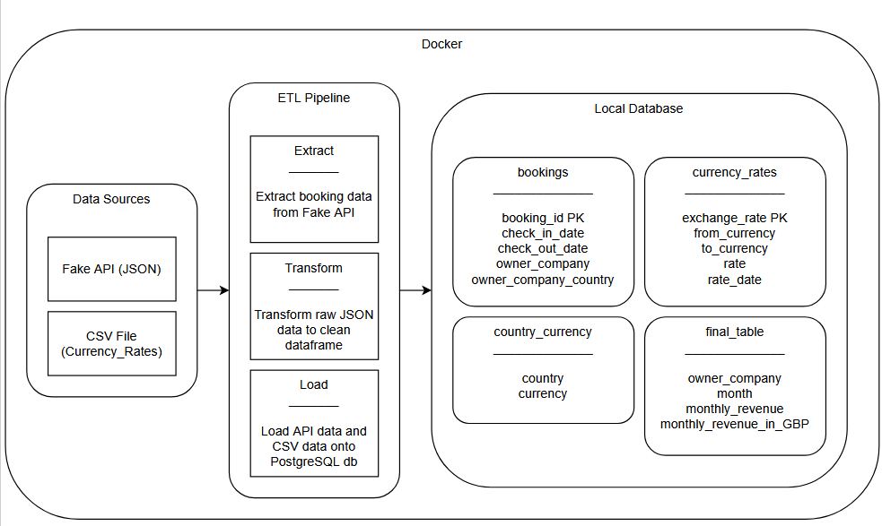

# Mahin Haque – Truvi Data Engineering Challenge Solution

## Summary

* **Goal:** Build an data pipeline that ingests booking & currency data, processes it, and outputs a clean, aggregated revenue table for analysts and finance teams.
* **Tech Stack:** Python, Pandas, PostgreSQL, SQL, Flask, Docker, Docker Compose
* **Outcome:** A table that lists the monthly revenue for each owner Company in both original currency and GBP.

---

## Architecture

```text
Fake API + CSV Data
    ↓
Extract (API calls)
    ↓
Transform & Load (cleaning, reshaping, store in PostgreSQL)
    ↓
Aggregate (monthly revenue per company, convert to GBP using avg monthly rates)
    ↓
Final Table (analyst & finance-ready)
```

**Diagram:**


---

## Setup

This section will detail how to run the programme, both on docker and manually. It is to be assumed that you already know how pull and clone projects from github to your system.

### Prerequisites

* Docker & Docker Compose
* Python 3.8+
* Pip

### Quick Run (Docker)

```bash
docker-compose up --build
```

This starts:

1. The Fake API serving booking data from CSV (`fake_api/fake_bookings.csv`)
2. The ETL pipeline that fetches, transforms, and loads data into PostgreSQL
3. Final revenue table generation & presentation

Why:
The idea to run the project on one command is so that it is easier and quicker for users to run the project and access the data, granted they have the prerequisites.

### Manual Run (Optional)

```bash
# Create virtual environment
python -m venv venv
# Activate virtual environment (Mac/Linux)
source venv/bin/activate
# Activate virtual environment (Powershell)
venv\Scripts\activate

# Install dependencies
pip install -r requirements.txt

# Set environment variables for DB connection
export DB_HOST=localhost
export DB_USER=etl_user
export DB_PASSWORD=etl_pass
export DB_NAME=etl_db
export DB_PORT=5432

# Run the Fake API
python fake_api/fake_api.py

# Run the ETL pipeline
python main.py
```

---

## Deliverables

The deliverables for my solution are:

* **DB:** A PostgreSQL database
* **Ingestion:** An ETL pipeline that ingests data from various sources into the database
* **bookings.sql:** A bookings table to store Truvi's customer data
* **currency_rates.sql:** A currency rates table to store daily 2024 exchang rates for revenue conversion
* **country_currency.sql:** A country + currency table for easier to fetch currency data without hard-coding in SQL
* **final_table.sql:** A final table to display each Owner Company's monthly revenue in USD, EUR, and GBP
* **final_Tables.csv:** A CSV file of the final table. This is to present the data in it's own file without having to run the programme again 

---

## How It Works

**Phase 1 – Setup & API**

* Install root dependencies (`requirements.txt`).
* Install `fake_api` dependencies (Flask).
* Start the Fake API serving booking data from `fake_bookings.csv`.

**Phase 2 – Extraction & Transformation**

* Fetch booking data from the Fake API.
* Load currency rates from CSV and store them in PostgreSQL.
* Clean and reshape datasets using Pandas as part of the load process.

**Phase 3 – Loading**

* Create database tables:

  * `bookings` (from API)
  * `currency_rates` (from CSV)
  * `country_currency` (manual mapping)

**Phase 4 – Aggregation & Presentation**

* Compute monthly average exchange rates for each currency to GBP.
* Aggregate revenue per Owner Company per month.
* Apply minimum fees and calculate total revenue in original currency.
* Convert revenue to GBP using monthly average rates.
* Output a readable, sorted final table via `final_table_presentation.sql`.

---

## Project Structure

```text
.
├── content_deliverables/
│   ├── main.py                       # Entry point for the ETL pipeline
│   ├── extract.py                    # Fetches booking data from the Fake API & loads currency CSV
│   ├── load.py                       # Creates tables and loads data into PostgreSQL
│   ├── create_country_currency.py    # Builds `country_currency` reference table
│   ├── create_final_table.py         # Aggregates monthly revenue per owner, computes GBP equivalents
│   ├── present_final_table.py        # Formats, presents, and exports the final table output in CSV file
│   │
│   ├── Dockerfile                    # Docker image definition
│   ├── docker-compose.yml            # Multi-container orchestration
│   │
│   ├── bookings.sql                  # Bookings table schema
│   ├── currency_rates.sql            # Currency rates table schema
│   ├── country_currency.sql          # Country–currency mapping table schema
│   ├── final_table.sql               # Final aggregated revenue table schema
│   └── final_table_presentation.sql  # Query for presenting final data
│
├── fake_api/
│   ├── fake_api.py                   # Flask app simulating a REST API from CSV
│   ├── fake_bookings.csv             # CSV file of booking data for Fake_API
│   └── requirements.txt              # Dependencies for Fake API (Flask, etc.)
│
├── output/
│   └── final_table.csv               # Where the contents of the final table would be stored once solution is ran
│
├── config.py                         # Runtime params (paths, table names, etc.)
├── architecture.png                  # Architecture diagram
└── currency_rates.csv                # CSV file containing daily exchange rates per currency in 2024 
```

### File Descriptions

| File/Dir                     | Purpose                                                            |
| ---------------------------- | ------------------------------------------------------------------ |
| `main.py`                    | Orchestrates ETL (extract → transform/load → aggregate → present). |
| `extract.py`                 | Fetches booking data from Fake API & loads currency CSV.           |
| `load.py`                    | Creates tables and loads data into PostgreSQL.                     |
| `create_country_currency.py` | Builds `country_currency` reference table.                         |
| `create_final_table.py`      | Aggregates monthly revenue per owner, computes GBP equivalents.    |
| `present_final_table.py`     | Produces and exports a neat, human-readable final output.          |
| `*.sql`                      | Table schemas, inserts, aggregation, and presentation queries.     |
| `fake_api/fake_api.py`       | Flask app simulating a REST API from CSV.                          |
| `docker-compose.yml`         | Spins up Fake API and ETL pipeline.                                |
| `Dockerfile`                 | Container image for the pipeline.                                  |
| `config.py`                  | Centralized configuration for table names, API URL, etc.           |
| `output/final_table.csv`     | Stored contents of the Final Table.                                |

---

## Use Cases

* **BI Integration:** Import into PowerBI, Looker, or Tableau to build dashboards.
* **Data Science:** Extend to predict monthly revenue per owner using ML models, assuming there is data for other years, not just 2024.

---

## Assumptions

* **Data Transformation:** Tranformed bookings data with no null values, to ensure that it goes throught ETL process like real data.
* **Exchange rate averaging:** Monthly average = mean of all daily rates in `currency_rates`.
* **Minimum fees:** Applied per country per month to ensure a revenue floor.
* **Error Handling:** Implemented necessary error handling to ensure that problems are easily identifiable.
* **Prerequisites:** Assumed that the users running this programme will already have the prerequisites installed.

---

## Optimisations

* **Readability:** Clear, modular Python code.
* **Analyst-friendly:** Complex logic lives in `.sql` files so DA/Finance teams can review or tweak queries.
* **Ease of use:** Single `docker-compose up --build` starts all services.
* **Error Handling and Logging:** Comprehensive try/except blocks across all ETL stages to ensure failures are handled gracefully, with detailed logging for easy debugging and monitoring.
* **Reusability:** ETL steps split into focused modules (`extract.py`, `transform.py`, `load.py`, etc.) for easy maintenance and extension.
* **Data Export:** Final processed table is not only displayed in the terminal but also automatically saved to CSV for further offline analysis.

---

## Future Improvements

* **Rename final table** to `monthly_revenue_by_owner_company` for production clarity.
* **Automate country–currency mapping** by joining country_currency table to both bookings and currency_rate tables.
* **Incremental API fetching** to avoid reprocessing the same bookings.
* **Analytics UI** (Streamlit) for revenue visualization.
* **Better Ingestion for Currency_Rates** by making the CSV data go through proper ETL process instead of just being loaded.
* **Further Orchestration:** Implement orchestration that runs project multiple times automatically. 

---

## Troubleshooting

* **Docker cache issues:** Try `docker-compose build --no-cache`.
* **Virtualenv activation (Windows):** Use `venv\Scripts\activate`.
* **Fake API port conflicts:** Ensure port 5000 isn’t in use; adjust in `fake_api.py` / `docker-compose.yml`.
* **DB connection issues:** Confirm environment variables match `config.py`.

---

## Summary

This project is a solution to the Truvi Take Home Challenge. The solution locally creates a PostgreSQL database and a data pipeline that extracts, transforms, and loads data from both an API and a CSV file. It then uses those tables to create the final table, showing the monthly revenue of Truvi's customers, in their original currency and in GBP. The data is shown in the terminal and in a CSV file inside a output subfolder created by the programme.

---

## Run Command (Summary)

```bash
docker-compose up --build
```
